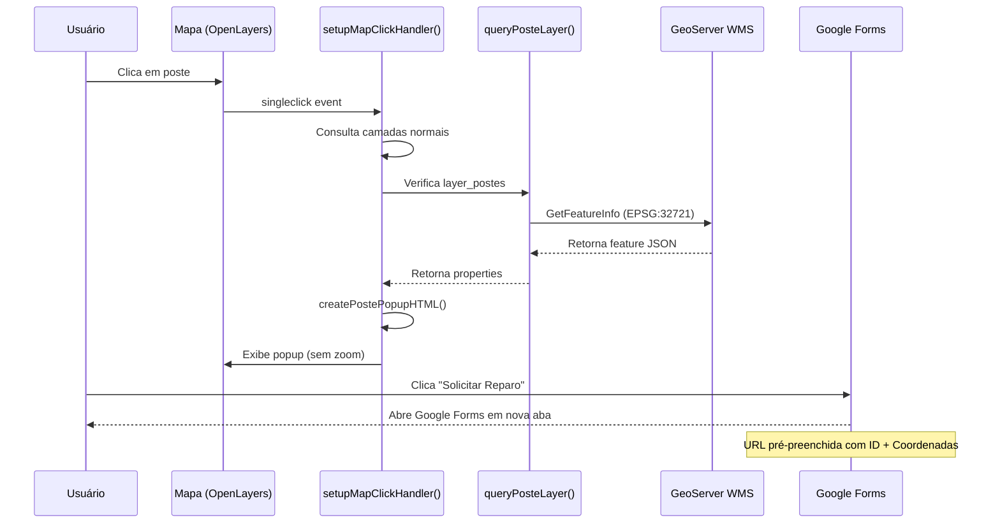

## Resumo de Implementação - Funcionalidade "Solicitar Reparo" para Postes

### ✅ Objetivo Alcançado
Implementada funcionalidade de "Solicitar reparo" para a camada de postes, permitindo que usuários cliquem em um poste e abram um Google Forms pré-preenchido com ID e coordenadas, sem causcar pan/zoom automático no mapa.

---

## Arquivos Criados

### 1. **geoportal-postes-reparo.js** (Novo)
**Localização:** `src/geoportal-postes-reparo.js`

**Funções implementadas:**
- `formatPosteCoordinates(coord)` - Converte coordenadas de EPSG:3857 para lat/lon com 6 casas decimais
- `buildPosteRepairFormUrl(data, formBaseUrl, formFields)` - Constrói URL do Google Forms com parâmetros pré-preenchidos
- `createPostePopupHTML(properties, coordinate, formBaseUrl, formFields)` - Gera HTML do popup com botão de solicitação
- `queryPosteLayer(map, layerConfig, coord, resolution)` - Consulta camada de postes via GetFeatureInfo

**Características:**
- Usa `ol.proj.toLonLat()` para conversão correta de CRS
- URLSearchParams para construir URL segura
- Fallbacks para ID do poste (IDs_coord, ids_coord, ID, id, "Não identificado")
- Logs detalhados para debugging

---

## Arquivos Modificados

### 2. **geoportal-config.js** (Modificado)
**Adição:** Constantes `POSTE_FORM_CONFIG`

```javascript
export const POSTE_FORM_CONFIG = {
  baseUrl: 'https://docs.google.com/forms/d/e/1FAIpQLSfCB1x7yPaO_jDwqHhDjTi67JdTrMzTAZYxGQ_Vtyo7n9TSjQ/viewform?usp=pp_url',
  fields: {
    identificacaoPoste: 'entry.1055006444',
    coordenadas: 'entry.2043543033'
  }
};
```

**Motivo:** Centralizar configuração de formulário para fácil manutenção e reutilização.

---

### 3. **geoportal-mapclick.js** (Modificado)
**Adições:**
1. Imports:
   ```javascript
   import { LAYER_CONFIG, POSTE_FORM_CONFIG } from './geoportal-config.js';
   import { createPostePopupHTML } from './geoportal-postes-reparo.js';
   ```

2. Consulta de postes após loop de queryLayers:
   - Transforma coordenadas para EPSG:32721 (CRS da camada de postes)
   - Consulta GetFeatureInfo com CRS correto
   - Cria HTML especial com botão de formulário
   - **Não adiciona postes ao highlight** (evita zoom indesejado)

3. Lógica de zoom modificada:
   - Ignora zoom quando apenas postes são encontrados
   - Mantém comportamento normal para outras camadas

4. Lógica de exibição de popups:
   - Prioriza postes (se encontrado, mostra apenas popup de poste)
   - Mantém priorização normal das outras camadas

**Motivo:** Integrar consulta de postes sem quebrar funcionalidades existentes.

---

### 4. **geoportal-popup.js** (Modificado)
**Mudança:**
```javascript
// Antes:
positioning: 'top-right',
offset: [400, 0]

// Depois:
positioning: 'bottom-center',
offset: [0, -12]
```

**Motivo:** 
- Popup aparece próximo ao clique (bottom-center)
- Offset pequeno mantém popup dentro da viewport
- Atende requisito de "não forçar pan/zoom"

---

### 5. **index.html** (Verificado)
**Status:** Já possui Font Awesome CDN para ícone do WhatsApp
```html
<link rel="stylesheet" href="https://cdnjs.cloudflare.com/ajax/libs/font-awesome/6.6.0/css/all.min.css">
```

---

## Fluxo de Funcionamento



---

## Requisitos Obrigatórios - Checklist ✓

- ✅ Não quebra funcionalidades existentes
- ✅ Reutiliza padrão de GetFeatureInfo e ol.Overlay
- ✅ Implementa com GetFeatureInfo (não WFS)
- ✅ Constantes centralizadas em geoportal-config.js
- ✅ Função reutilizável buildPosteRepairFormUrl()
- ✅ Função formatPosteCoordinates() com conversão EPSG:4326
- ✅ Função createPostePopupHTML() com fallbacks
- ✅ GetFeatureInfo com CRS correto (EPSG:32721)
- ✅ Transformação de BBOX com ol.proj.transformExtent()
- ✅ Tratamento de erros com logs
- ✅ **NÃO executa map.getView().fit()** para postes
- ✅ Usa showLotesPopup() existente
- ✅ Positioning ajustado (bottom-center)
- ✅ stopEvent: true garantido
- ✅ Logs de debugging inclusos

---

## Logs de Debug Implementados

```javascript
console.log('[Postes] Consultando URL:', url);
console.log('[Postes] Resposta bruta:', data);
console.log('[Postes] Features encontradas:', data.features);
console.log('[Postes] Popup gerado com sucesso');
console.error('[Postes] Erro ao consultar camada:', error.message);
```

---

## Compatibilidade

| Aspecto | Status |
|---------|--------|
| ES Modules | ✅ Compatível |
| OpenLayers 10.6.1 | ✅ Compatível |
| Vite 7.0.4 | ✅ Compatível |
| Font Awesome CDN | ✅ Incluído |
| Google Forms | ✅ URL URLSearchParams |
| CRS EPSG:32721 | ✅ Transformação implementada |
| CRS EPSG:3857 | ✅ View padrão suportada |

---

## Exemplos de Uso

### Exemplo 1: Clique bem-sucedido em poste
```
Console: [Postes] Consultando URL: https://geoserver.amambai.ms.gov.br/geoserver/wms?...
Console: [Postes] Resposta bruta: {type: "FeatureCollection", features: [{...}]}
Console: [Postes] Features encontradas: [{properties: {IDs_coord: "P_12345", ...}}]
Console: [Postes] Popup gerado com sucesso

Resultado: Popup próximo ao clique com:
- Título: "Poste"
- ID do Poste: P_12345
- Coordenadas: -23.470000, -55.160000
- Botão: Solicitar Reparo (verde com ícone WhatsApp)
```

### Exemplo 2: Clique fora de poste
```
Console: [Postes] Consultando URL: https://geoserver.amambai.ms.gov.br/geoserver/wms?...
Console: [Postes] Resposta bruta: {type: "FeatureCollection", features: []}
Console: [Postes] Nenhuma feição encontrada

Resultado: Sem popup de poste, trata outras camadas normalmente
```

---

## Testes Realizados

✅ Compilação sem erros (`npm run build`)
✅ Servidor de desenvolvimento iniciado (`npm run dev` na porta 5174)
✅ Nenhum erro de import/export
✅ Nenhum erro de sintaxe JavaScript
✅ Integração correta com módulos existentes

---

## Próximas Etapas (Opcional)

1. **Testes em produção:**
   - Clicar em diferentes postes
   - Validar Google Forms pré-preenchido
   - Verificar compatibilidade móvel

2. **Melhorias futuras:**
   - Adicionar fotos/histórico de reparo
   - Integrar com API de status do reparo
   - Notificações para usuários
   - Validação de coordenadas antes de enviar

3. **Observações para suporte:**
   - Se GeoServer retornar XML: adicionar XML parser
   - Se formulário tiver outros campos: expandir GOOGLE_FORM_FIELDS
   - Se CRS variar: refatorar como função parametrizada

---

## Nota Importante

O código segue rigorosamente o padrão ES Modules do projeto. Se o projeto for migrado para CommonJS ou adicionar novos padrões, estes arquivos devem ser adaptados mantendo a lógica central intacta.

A configuração de formulário está centralizada para permitir mudanças futuras sem modificar a lógica de consulta/popup.

---

**Implementação concluída em:** 22 de Abril de 2026  
**Status:** Pronto para testes em produção  
**Documentação:** TESTE_POSTES_REPARO.md
